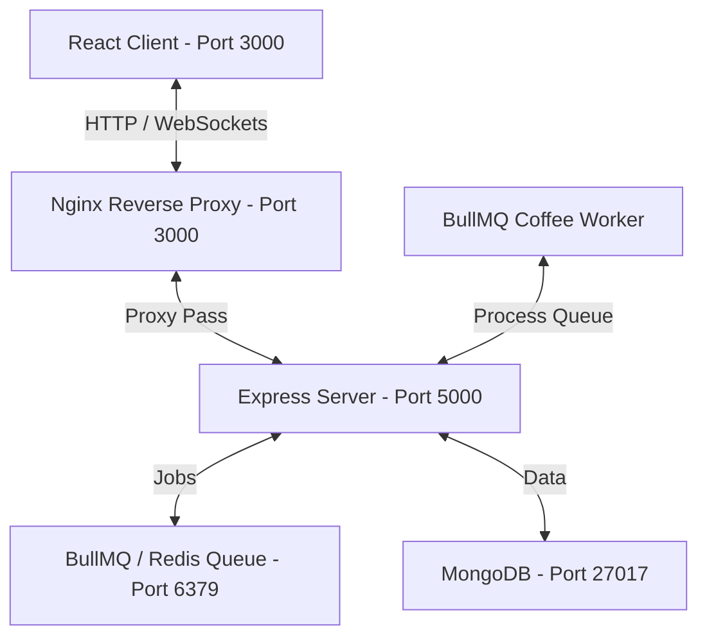

# ☕ Virtual Coffee Machine

A smart, responsive web application for simulating a digital office coffee machine queue. Supports priority queueing, delayed preparation, real-time status tracking, reporting exports, and user analytics.

---

## 🚀 Tech Stack

- **Frontend**: React (TypeScript), React Router, Material UI (MUI), Socket.io-client, Lucide Icons, SheetJS (`xlsx`) for reports.
- **Backend**: Node.js (Express), TypeScript, Mongoose, Socket.io, Swagger UI & OpenAPI 3.0 specification (`swagger-ui-express`, `swagger-jsdoc`).
- **Queue/Broker**: Redis, BullMQ (Priority & Delayed queues).
- **Database**: MongoDB.
  * **Database Choice Rationale**: MongoDB was selected because coffee orders are document-oriented records. Storing them as JSON documents in a schema-flexible store allows adding custom order attributes (e.g. coffee type, milk, sugar level) in the future without database migrations. It integrates seamlessly with Node.js via Mongoose.
- **Infrastructure**: Docker, Docker Compose, Nginx (routing proxy).

---

## 📂 Project Architecture & Directory Structure

The application is built on a modern, decoupled Full-Stack architecture:



```text
/ (Project Root)
├── docker-compose.yml         # Container services orchestration
├── README.md                  # Project documentation (merged guide)
├── AIPOLICY.txt               # AI use-case log and declaration
├── backend/                   # Node.js API server & Queue processor
│   ├── Dockerfile
│   ├── tsconfig.json
│   ├── package.json
│   └── src/
│       ├── app.ts             # Express entry point & routing
│       ├── config/            # Mongoose, Redis, and Socket.io initialization
│       ├── controllers/       # HTTP request handlers (Orders, Reports, Histogram)
│       ├── models/            # Mongoose Order schema
│       ├── services/          # Business logic & BullMQ producers
│       ├── workers/           # BullMQ queue workers (coffee simulation)
│       └── mock/              # In-memory database & worker fallbacks (USE_MOCK="true")
└── frontend/                  # React SPA
    ├── Dockerfile
    ├── nginx.conf             # Production container reverse proxy configuration
    ├── vite.config.ts         # Development proxy configurations (port 3000 -> 5000)
    ├── package.json
    └── src/
        ├── App.tsx            # Main layout, routing, and MUI Theme Provider
        ├── components/        # Cards, custom form controls, and progress bars
        ├── context/           # OrderContext.tsx (Socket connection & global state)
        └── pages/             # Dashboard, Order Form, Reports, Analytics
```

---

## ⚙️ Core Architectural Modules

### A. Real-Time State Management & Decoupling
- **Global Context (`OrderProvider`)**: Declared in [OrderContext.tsx](file:///D:/קפה/frontend/src/context/OrderContext.tsx). It acts as the single source of truth for the entire application, caching the order queue and active brewing progress.
- **Custom React Hook (`useOrders`)**: Pages consume state and actions (like submitting an order) purely through `useOrders()`. All networking, error boundaries, and socket hooks are completely separated from the UI layout.

### B. Event-Driven WebSockets (Socket.io)
- Instead of HTTP polling, a persistent WebSocket connection is opened:
  - When the BullMQ worker starts brewing, the backend emits `order:updated`.
  - When the worker finishes preparation, it updates the status and emits `order:updated`.
  - The client catches the socket event, instantly updating the React state list.

### C. Desktop & In-App Alerts
- **In-App Toast Fallback**: An animated Material UI `Snackbar` and `Alert` slide in from the top-right the moment the user's specific coffee is ready.
- **HTML5 Web Notifications**: Triggers native desktop popups when the browser tab is minimized or unfocused, ensuring the user gets their pick-up alert.

### D. Priority & Delayed Queues
- **VIP Priority**: Submitting as a "Boss" with the correct password (`coffee_boss`) sets the queue job priority to `1`, putting it in front of normal employee orders (priority `2`).
- **Delayed Brewing**: Users can schedule coffee preparation. The backend queues the job with a specific millisecond delay, holding it until the scheduled time.

---

## 🛠️ Getting Started

### Prerequisites
Make sure you have [Docker Desktop](https://www.docker.com/products/docker-desktop/) installed and running on your system.

### Running with Docker (Recommended)

1. Clone or navigate to the repository directory.
2. Spin up the containers using Docker Compose:
   ```bash
   docker-compose -p coffee up --build
   ```
3. Once running, access the services:
   - **Frontend App:** [http://localhost:3000](http://localhost:3000)
   - **Backend API:** [http://localhost:5000](http://localhost:5000)
   - **MongoDB Database:** `mongodb://localhost:27017`
   - **Redis Instance:** `redis://localhost:6379`

### Running Locally (Mock Mode - No Docker Required)

If Docker is unavailable, the application can run in **Mock Mode** using in-memory arrays for database/queue storage:

1. Install dependencies in both folders:
   ```bash
   cd backend && npm install
   cd ../frontend && npm install
   ```
2. Start the backend dev server in mock mode:
   ```bash
   cd backend
   # Windows PowerShell
   $env:USE_MOCK="true"; npm run dev
   # Bash/macOS
   USE_MOCK=true npm run dev
   ```
3. Start the React frontend dev server:
   ```bash
   cd ../frontend
   npm run dev
   ```
4. Access the React client on [http://localhost:5173](http://localhost:5173).

---

## 📝 Configuration (`.env`)

- **Backend Configuration (`backend/.env`):**
  - `PORT`: Server port (default: `5000`).
  - `USE_MOCK`: Set to `true` to run mock mode locally.
  - `BOSS_PASSWORD`: Password required to prioritize VIP orders (default: `coffee_boss`).

To set a custom VIP password in Docker, add it under `environment` in [docker-compose.yml](file:///D:/קפה/docker-compose.yml):
```yaml
backend:
  environment:
    - BOSS_PASSWORD=my_custom_password
```

---

## 📈 REST API & Interactive Documentation

The backend exposes an interactive **Swagger API Console** at **[http://localhost:3000/api](http://localhost:3000/api)**. 

### Key Endpoints:
- `POST /api/orders` - Creates a new coffee request (validates user inputs, handles priority/delay).
- `GET /api/orders` - Fetches active queue and log history.
- `GET /api/reports` - Returns orders filtered by year and month.
- `GET /api/histogram` - Aggregates orders per user to draw analytics charts.

---

## ☕ Verification Guide

1. **Dashboard Monitoring**: Open the dashboard page to monitor active states. The brewing machine includes animated steam.
2. **Placing Normal Orders**: Submit an order under the "Employee" role. The dashboard will show status `In Queue` -> `Brewing` -> `Ready` (takes 5 seconds of mock preparation).
3. **Placing Priority Orders**: Submit an order as a "Boss" using the VIP password (`coffee_boss`). Boss requests will be pushed ahead of normal employee requests in the queue.
4. **Delayed Orders**: Submit a delayed request (e.g. 2 minutes). The worker will wait exactly 2 minutes before starting preparation.
5. **Analytics & Graphs**: View the SVG-based bar chart aggregation under the **Analytics** page. Click refresh to update.
6. **Exports**: Filter orders by year/month on the **Reports** page and click **Export to .xlsx** to download a spreadsheet.
